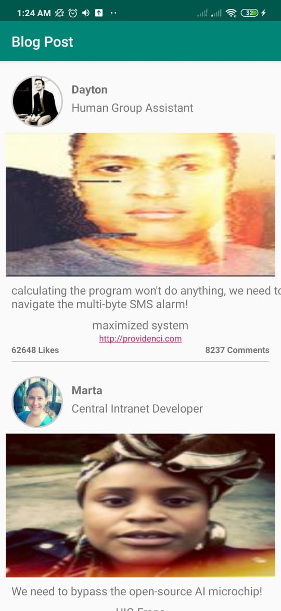

This is android example with Kotlin, Data Binding, Retrofit using Rest API web services 

Introduction
------------
The goal of this Android Native application is to implement interface with  REST API web service. 

Getting Started
---------------
This project uses the Gradle build system. To build this project, use the
`gradlew build` command or use "Import Project" in Android Studio.

Android Studio IDE setup
------------------------
For development, the latest version of Android Studio is required with Kotlin plugin configure. The latest version can be
downloaded from [here](https://developer.android.com/studio/).

- Start Android Studio and import or open project.

Libraries Used
--------------
* [Android Kotlin](https://developer.android.com/kotlin) - Write more concise, idiomatic Kotlin code.
* [Retrofit](https://square.github.io/retrofit/) - to consume JSON data via HTTP REST client
* [Picasso](https://square.github.io/picasso/) - for lazy image loading
* [Room](https://developer.android.com/training/data-storage/room) - Database library over SQLite

Screenshots

